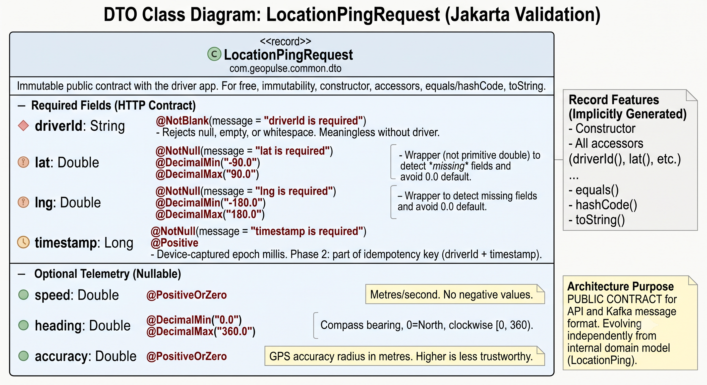

# Phase 1 · Sprint 1 — The Ingestion Endpoint

> **Project:** High-Concurrency Location Tracking & Spatial Ingestion Engine — *Project 1 of 3*
> **Session goal:** Build the write path's front door — a validated, non-blocking `POST /v1/locations` that returns an honest `202 Accepted`.
> **Status:** ✅ Verified — happy path returns 202; missing `lat` returns a 400 naming the field.

---

## The governing principle: the edge stays thin

This endpoint sits directly under the firehose. **Anything it does is done 250,000 times a second**, so every line must justify itself.

**What it does:** `validate → translate → publish → acknowledge`

**What it must NEVER do:**
- ❌ **Database writes** — a blocking I/O call would couple request latency to disk latency. A slow disk becomes a slow API.
- ❌ **Business logic** — matching, pricing, fraud checks all belong downstream, reading from Kafka.
- ❌ **Calls to other services** — a synchronous dependency means *their* outage becomes *your* outage.

> **Kafka is the shock absorber** between an unbounded, bursty write storm and everything that needs to happen with the data. The controller's only job is to load the buffer and get out of the way.

---

## Part 1 — DTO vs Domain Model (two types, on purpose)

They look nearly identical. They are **not** duplication — they serve different masters and change for different reasons.

| | `LocationPingRequest` (DTO) | `LocationPing` (domain) |
|---|---|---|
| Contract with | The **outside world** (driver app) | **Ourselves** (Kafka consumers) |
| Trust level | Untrusted, defensive | Already validated, trusted |
| Changes when | The public API version changes | Internal needs change |
| Location | `common/dto/` | `common/model/` |

{width="50%"}
**Fuse them and you weld your public API to your internal message format:** adding an internal field changes your public JSON; versioning your API forces a Kafka schema migration. That coupling is what bites teams six months in.
**The controller translates at that boundary** — untrusted DTO in, trusted domain object out.

### 🔥 The `Double` vs `double` trap (the big one)

```java
@NotNull @DecimalMin("-90.0") @DecimalMax("90.0")
Double lat        // wrapper — NOT primitive
```

A primitive `double lat` **silently defaults to `0.0`** when the field is *missing* from the JSON. And `0.0` is a **valid latitude** (the equator). So a missing field would sail through range validation as a real location in the Gulf of Guinea — **silent data corruption**, invisible in tests.

The wrapper stays `null` → `@NotNull` fires → client gets a clean `400`. ✅ *Verified live: omitting `lat` returns `{"fields":{"lat":"lat is required"}}`.*

### The primitive/wrapper choice FLIPS in the domain model
```java
public record LocationPing(
    String driverId,
    double lat,        // primitive — validation ALREADY guaranteed presence
    double lng,
    long   timestamp,
    Double speed,      // boxed — null is MEANINGFUL ("device didn't report it")
    Double heading,
    Double accuracy
) { ... }
```
The type system now encodes **which fields are guaranteed and which are optional**.

### Immutability is a concurrency strategy, not a style tic
`LocationPing` is a `record` → immutable. It's produced on a Tomcat thread, serialized, sent over the network, deserialized on a consumer thread, and read by code writing to two datastores. Because it can never mutate, **none of those hand-offs need a lock or a defensive copy**. In a pipeline whose entire premise is "avoid contention," making the core data type immutable is the cheapest win available.

### Why capture `speed` / `heading` / `accuracy` now?
**Ingestion is the one irreversible moment.** You can always add a *consumer* later; you can never go back and collect last month's headings. Their uses (mostly Projects 2–3):
- **`heading` + `speed` → dead reckoning.** Extrapolate position between pings so the car *glides* on the rider's map instead of teleporting every 4s. This is how a laggy pipeline is made to *feel* instant.
- **`heading` → better matching.** A driver 200m away heading *away* on a divided highway is a worse match than one 400m away heading toward you. Straight-line distance lies.
- **`accuracy` → data-quality gate** (built this session, see 3b).
- **`speed` → anomaly detection.** A driver "moving" at 300 km/h is a GPS glitch or a spoofed client.

> ⚠️ **Business data ≠ observability.** `speed`/`heading`/`accuracy` describe **the driver** (→ Kafka → Redis/Cassandra). OpenTelemetry/Micrometer metrics describe **our system** (→ Prometheus → Grafana, Phase 6). Same word "telemetry," two universes.

---

## Part 2 — The controller

### `@Valid` is load-bearing
Every annotation on the DTO does **nothing** without `@Valid` on the controller param. Forget it and `lat: 9999.0` sails straight through. Classic silent failure: code compiles, garbage enters the pipeline.

### Why `202 Accepted`, not `200 OK`
`200` claims "stored and durable" — **a lie**, since we've only handed the ping to Kafka; the consumer hasn't processed it. `202` honestly says *"I've taken responsibility; processing is in flight."* The response body is empty (`Void`) — at 250k/s, **the status code IS the response**.

### The batch endpoint (`POST /v1/locations/batch`)
1. A driver app that lost connectivity buffers pings and flushes on reconnect.
2. **Throughput:** HTTP overhead (headers, TLS, connection handling) is paid *per request*. Batching 50 pings amortizes it ~50×. At scale this is the difference between needing 20 ingestion pods and 4.

`@Size(max = 100)` caps it — **never trust a client-controlled collection size** (a 1M-element array would blow the heap).

> **Tradeoff — all-or-nothing vs partial success:** one bad ping currently rejects the whole batch (400). The alternative is `207 Multi-Status` with a per-item report. All-or-nothing is right *here* **because location data is self-healing** — a rejected batch is repaired by the next ping in 4s. **If this were payments, partial success would be mandatory.** *"Which failure mode does the data's nature permit?"* is exactly what interviewers listen for.

### Why the thin service layer exists
The controller knows HTTP (status codes, headers); `LocationIngestionService` knows nothing about HTTP. That seam means we can add gRPC/WebSocket ingestion later and reuse it untouched, and unit-test ingestion without a web server.

---

## Part 3 — Hardening

### 3a. Error handling: log detail for us, hide detail from them
`@RestControllerAdvice` centralizes error shaping. The endpoint faces the public internet, so **error messages are an attack surface** — never leak stack traces or internal class names.

| Exception | Response | Logging |
|---|---|---|
| `MethodArgumentNotValidException` (bad data) | `400` + `field → message` map | **None** — see below |
| `HttpMessageNotReadableException` (bad JSON) | `400` generic message | None |
| `Exception` (our bug) | `500` **bland** message | `ERROR` + full stack trace, **server-side only** |

> **Don't log validation failures.** Bad client input is *expected traffic*, not a system fault. At 250k/s, logging every rejected ping floods the log pipeline — and hands an attacker a free DoS (make you write a log line per request → fill your disks). **Count them as a metric (Phase 6), don't log them.**

### 3b. The `accuracy` quality gate — "accept and discard"
GPS in a tunnel or urban canyon reports a 500m error radius. That ping is **worse than no ping**: it would overwrite a good position with a vague one.

We **drop it, but still return `202`** — the client did nothing wrong (its JSON is valid), so forcing a retry is pointless churn. Safe precisely because location data is **self-healing**: a better fix arrives in ~4 seconds.

```java
if (request.accuracy() != null && request.accuracy() > maxAccuracyMetres) {
    return;   // accepted, silently discarded
}
```
Note `accuracy != null` — **absent ≠ bad**. A missing accuracy means "unknown," which we accept. Threshold is externalized (`geopulse.ingestion.max-accuracy-metres`) because the right value is *discovered in production*, not guessed at design time.

### 3c. Virtual threads (Java 21 / Project Loom)
```yaml
spring:
  threads:
    virtual:
      enabled: true
```

**The problem:** Tomcat's thread pool (~200) maps each in-flight request to a **platform thread = 1 OS thread ≈ 1MB stack**. You can't just set it to 10,000 (10GB of stack + scheduler thrash). Under a firehose, requests queue waiting for a free thread and **p99 detonates — not because the work is slow, but because threads are scarce.**

**The fix:** virtual threads are JVM-managed, cost a few hundred bytes, and you can have *millions*. When one **blocks on I/O** (e.g. awaiting a Kafka ack), the JVM **unmounts it from its carrier OS thread**, freeing that OS thread for other work. Blocking code stops wasting an OS thread.

Perfect fit: our endpoint is almost pure **I/O-bound waiting** with negligible CPU work. And we get it with **one config line and zero code changes** — no reactive rewrite, no `Mono`/`Flux`, no callback hell.

> ⚠️ **The honest caveat (interviewers probe this):** virtual threads don't make anything *faster* — they raise the **concurrency ceiling**. If the bottleneck is CPU, they change nothing. Known sharp edge: blocking inside a `synchronized` block used to **pin** the carrier thread, defeating the purpose (largely fixed in Java 24). **Rule of thumb: prefer `ReentrantLock` over `synchronized` on virtual-thread paths.**

---

## Verification (all confirmed live)

| Test | Expected | Why it matters |
|---|---|---|
| Valid ping | `202`, empty body | Happy path ✅ |
| **Omit `lat`** | `400` — `"lat is required"` | **The `Double` trap, caught** ✅ |
| `lat: 200.0` | `400` — `"lat must be <= 90"` | Range bound (different path from `@NotNull`) |
| `accuracy: 500.0` | `202`, **but no log line** | Quality gate: accepted + discarded |
| Batch of 2 | one `202` | Amortized HTTP overhead |

---

## Key takeaways (revision list)

1. **The edge stays thin** — no DB writes, no business logic, no sync service calls. Kafka is the shock absorber.
2. **DTO ≠ domain model.** Fusing them welds your public API to your Kafka schema.
3. **`Double` not `double`** in DTOs — a primitive silently defaults to `0.0`, which is a *valid* latitude.
4. **Immutability = concurrency strategy** (lock-free hand-offs across threads).
5. **`202`, not `200`** — don't lie about durability in an async contract.
6. **Capture data at ingest**; consumers can come later, the data can't.
7. **Count errors, don't log them** on the hot path (log-flood DoS).
8. **Accept-and-discard** for bad-quality-but-well-formed data — safe *because* the data self-heals.
9. **Virtual threads** raise the concurrency ceiling for I/O-bound work — one config line, zero code changes.

## What's still missing
The two things that make this *our* system rather than a generic endpoint:
- **The H3 cell** → Sprint 1.2 (index space at the edge)
- **The Kafka publish** → Sprint 1.3 (where that placeholder `log.info` finally dies, and the partitioning decision gets made)

---

## Next → Phase 1 · Session 2 — H3 Geospatial Indexing
Convert lat/lng into a discrete hexagonal cell ID **at the ingestion edge**. Why hexagons beat squares, choosing a resolution, k-rings for neighbor search — and why this single field is what makes the whole partitioning strategy possible.