# Load Test Report — GeoPulse Ingestion Pipeline

**Seven runs. Two bottlenecks found and fixed. One claim deliberately left unproven.**

| | |
|---|---|
| **Tool** | k6 — `ramping-arrival-rate` (open-loop) |
| **Simulation** | Fleet of drivers walking plausible paths, weighted toward 8 Mumbai demand centres (airport 30%) |
| **Environment** | Single Windows laptop — generator, 7 Docker containers and 3–4 JVMs co-located |
| **Observability** | Micrometer → Prometheus → Grafana |

---

## Executive summary

```
Sustainable rate (lag drains during the run):   ~500 req/sec
Ingestion latency p99:                          ~1 ms       (SLO <50 ms)  ✅
Redis write p99:                                30–200 ms   (from 1,800 ms) — up to 60× better
Cassandra write p99:                            ~25 ms
Consumer threads:                               4
Per-thread throughput:                          ~125 records/sec
```

**Two real bugs found by measurement:**
1. **Unsized Redis connection pool** — threads queuing for connections, counted as Redis latency → **1,800 ms → 350 ms**
2. **Un-pipelined dedup** — one Redis round trip per record, ~150 ms of sequential latency per batch → **180 ms → 30 ms**

**The headline architectural result:** ingestion held **~1 ms p99 while consumer lag was 140,000 messages behind.** The write edge's cost is completely independent of downstream pressure.

**The headline correction:** measured per-consumer throughput was far below the 5,000/sec design estimate, **invalidating the original 64-partition sizing** — a one-way-door decision that would have been wrong in production.

---

## All seven runs at a glance

| # | Rate | Change | Redis p99 | Peak lag | Verdict |
|---|---|---|---|---|---|
| **1** | ramp → 10k | baseline | **1,800 ms** | **400k, never drained** | ❌ Catastrophic |
| **2** | ramp → 10k | Lettuce pool sized | ~350 ms | 160k climbing | ⚠️ 5× better, still failing |
| **3** | 500/s | IDE closed | ~180 ms | 10–20k **flat** | ✅ First sustainable run |
| **4** | 500/s | dedup pipelined | **~30 ms** → 150 ms | 12.5k, **drained mid-run** | ✅ Best result |
| **5** | 1,000/s | — | 150–200 ms | 125k climbing | ❌ Past the ceiling |
| **6** | 700/s | — | 150–200 ms | 55k climbing | ❌ Also past it |
| **7** | 1,000/s | **2nd instance** | 150–200 ms | **140k — no change** | ⚠️ Environment-bound |

---

## Run 1 — Baseline: everything fails except ingestion

**Profile:** 0 → 1k → 10k → 25k/s over 13 minutes.

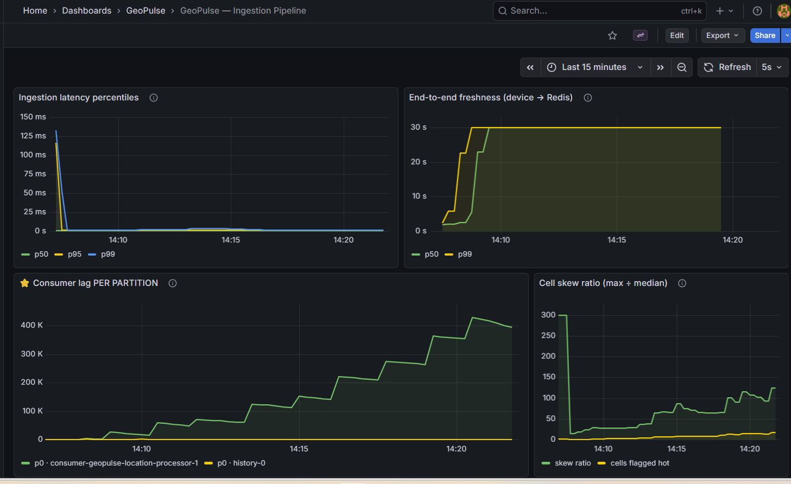

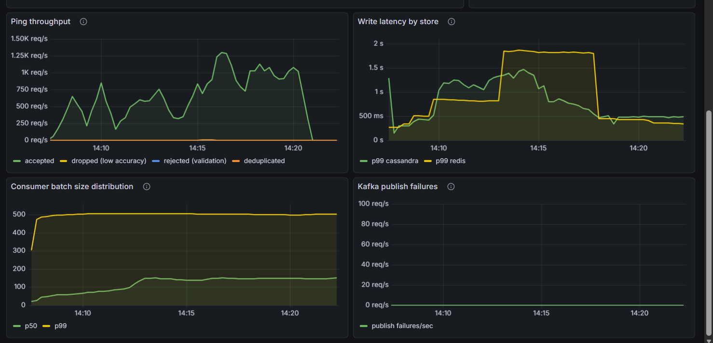

| SLO | Target | Measured | |
|---|---|---|---|
| Ingestion latency | p99 < 50 ms | **~0–5 ms after warm-up** | ✅ |
| End-to-end freshness | p99 < 2 s | **30 s** (metric's sanity ceiling) | ❌ >15× |
| Sustained throughput | 10,000/s | ~1,000/s achieved | ❌ 10× |
| Consumer lag | Bounded | **400,000, still climbing** | ❌ Unbounded |

**Reading it:**

- **The warm-up spike is visible and expected** — p99 hits ~125 ms for the first ~30 s while the JVM interprets before JIT compiles, then collapses to near zero. *Measure a cold JVM and your p99 is compilation, not your code.*
- **Lag climbed in steps tracking each ramp stage and never plateaued** — the consumer never caught up at any point.
- **Freshness of 30 s exceeds the 30-second presence TTL.** Drivers were expiring from the live index faster than they were refreshed — `nearby` would have returned almost nobody while thousands of drivers were actively pinging. *The airport-goes-dark scenario, produced accidentally by infrastructure.*
- **Batch p99 pinned at 500** (`max-poll-records`) for the entire run — the saturation signal.
- **Cell skew hit 300** — the fleet simulation produced exactly the hot cell it was designed to.

> **Three of the four failures are one failure.** Lag grows because the consumer can't drain; freshness degrades because lag grows. Single root cause: consumer write-path throughput.

### 🔥 The metric that lied

**Redis p99 read 1.8 seconds. Cassandra — the disk-backed store — was *faster* than the in-memory cache.**

Benchmarked directly, same machine, everything running:

```
$ docker compose exec redis redis-benchmark -t set -n 10000 -q
SET: 41,841 requests per second, p50 = 0.527 msec
```

And `docker stats` showed **Redis at 17% CPU.**

> **Redis wasn't slow — Redis was idle.** It's single-threaded: if it were the bottleneck it would be pegged near 100%, not loafing. **An idle component reporting high latency is waiting for someone else.**

**The queue was in front of Redis.** Our timer wraps the whole `writeAll` call — including **waiting for a connection from the Lettuce pool**, which was unsized and therefore tiny. Four consumer threads firing 500-command pipelines contended for a handful of connections.

> **A timer measures everything inside it, including waiting for the resource — not just using it.** *"The database is slow"* and *"I can't get a connection to the database"* look identical from outside and have **opposite fixes.**

---

## Run 2 — Connection pool sized

```yaml
spring.data.redis.lettuce.pool:
  max-active: 32
  max-idle: 16
  min-idle: 8
```

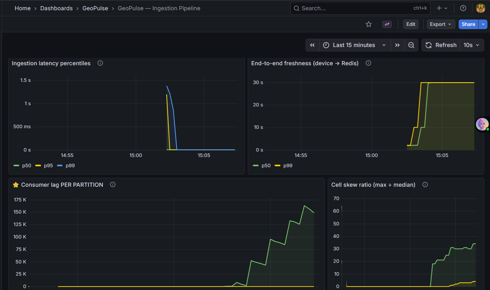

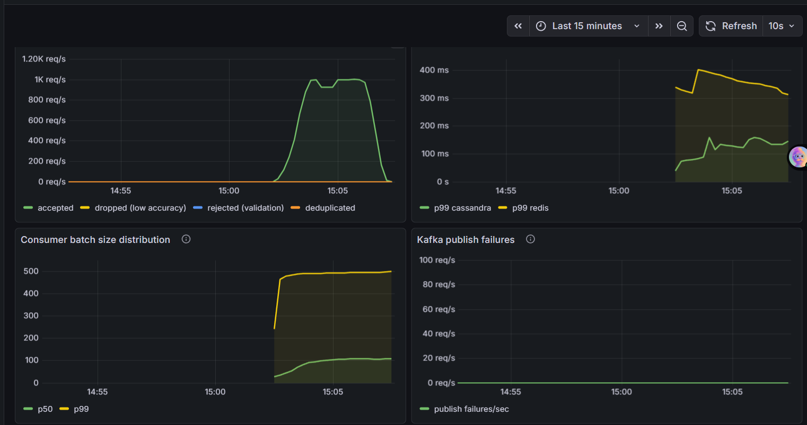

**Redis p99: 1,800 ms → ~350 ms.** A 5× improvement from one config block — the pool was genuinely starving threads. Hypothesis confirmed.

**But lag still grew to 160k at ~1,000/s.** The pool was *a* bottleneck, not *the* bottleneck.

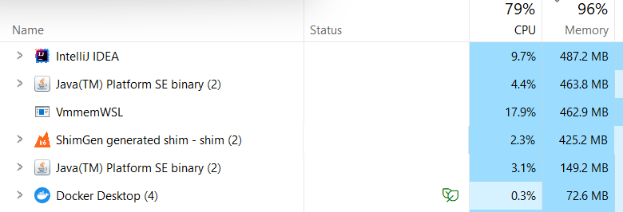

**79% CPU / 96% memory.** At that level Windows is paging, and paging makes everything slow **in a way that looks like application latency.** IntelliJ alone was taking 9.7% CPU and ~500 MB for an IDE not being used during the test.

---

## Run 3 — IDE closed, flat 500/s

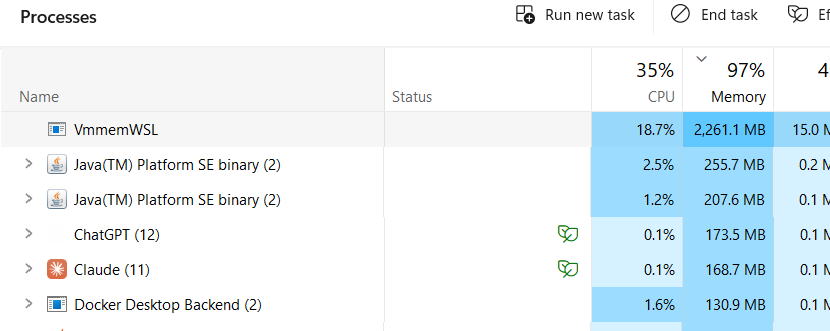

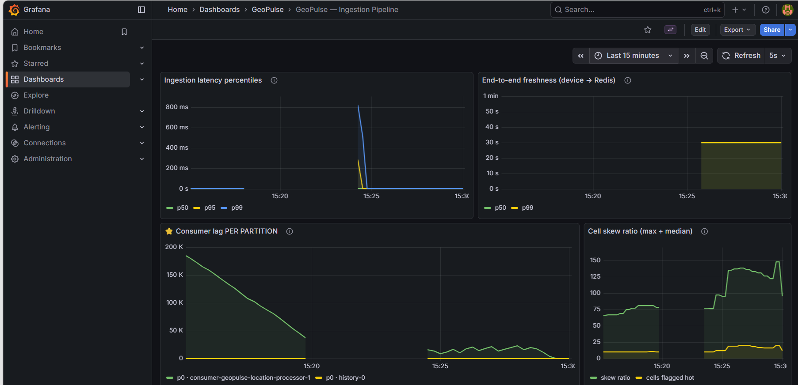

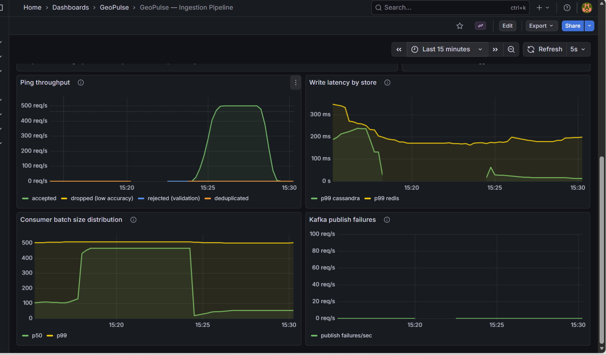

**The first passing run.** The left half of the lag panel shows the *previous* run's 175k backlog draining to zero; the new test starts at 15:25 and lag stays **flat around 10–20k, oscillating, never climbing.**

| Signal | Result |
|---|---|
| Consumer lag | **Flat ~10–20k** — consumer keeping up |
| Redis write p99 | ~180 ms |
| Cassandra write p99 | near zero |
| Ingestion p99 | ~0–5 ms |
| **Batch p50** | **450 → ~40** |

> **Small batches mean you're winning.** The consumer drains faster than messages arrive, so `poll()` returns whatever's there rather than a full 500. **Exactly inverted from the saturation signal** — batch p99 pinned at 500 in runs 1 and 2 was the pipeline telling us it never once cleared its backlog.

---

## Run 4 — Dedup pipelined (best result)

**The fix:** dedup was one Redis round trip *per record*.

```
500 records × ~0.3 ms round trip = ~150 ms, SEQUENTIAL
                                 → ~83% of the remaining latency
```

…and it happened **before** the batched write even started. `claimAll()` now claims the whole batch in one pipelined round trip, correlating results by position.

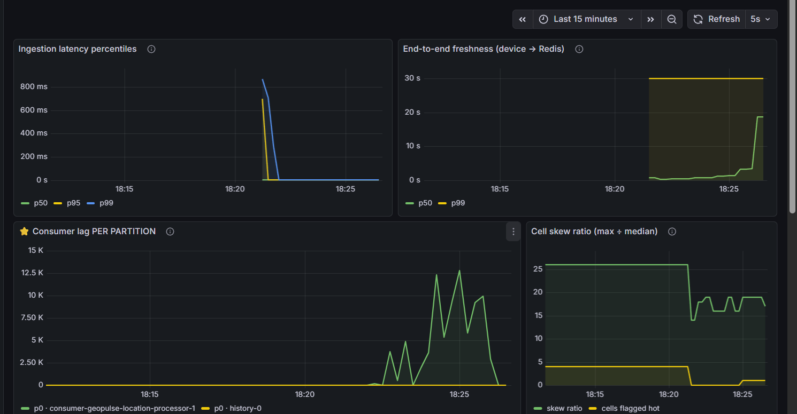

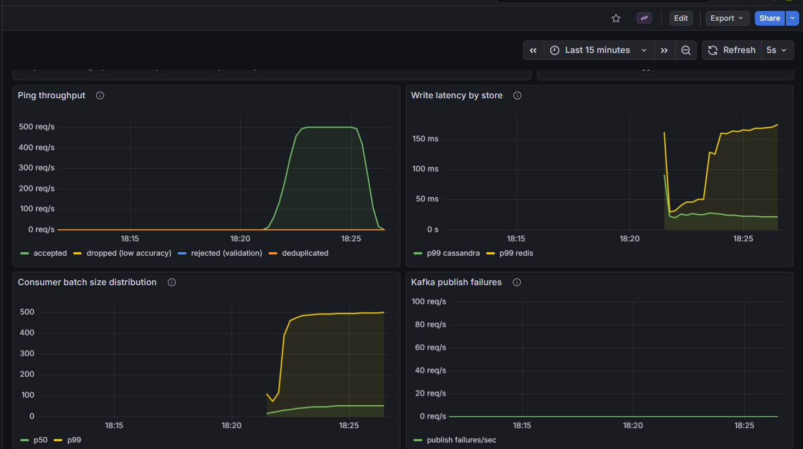

**Lag peaked at 12.5k and returned to zero *during* the run** — the consumer is fully keeping up with capacity to spare.

**Redis p99: ~180 ms → ~30 ms** at the start, climbing to ~150 ms as the run progressed (accumulating dedup keyspace under a 300 s TTL).

> **Combined with the pool fix: 1,800 ms → 30 ms. A ~60× improvement — both found by measurement, both invisible without instrumentation.**

---

## Run 5 — 1,000/s: past the ceiling

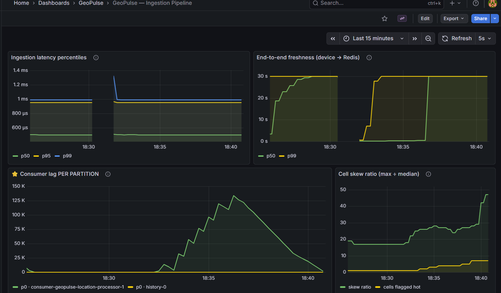

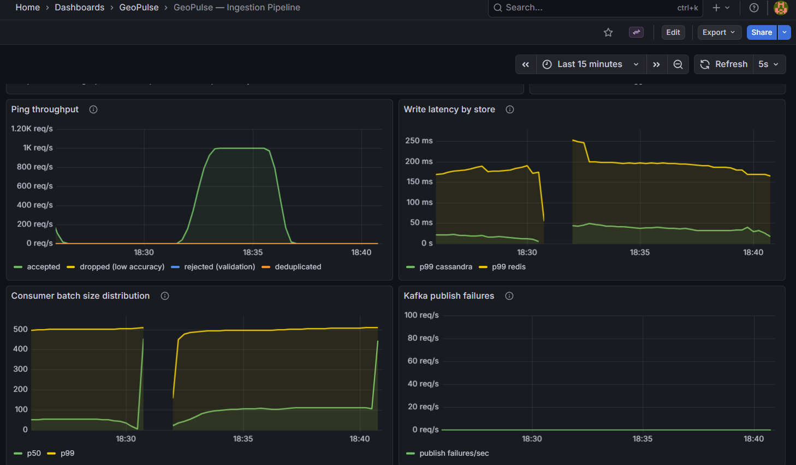

**Lag climbed to 125k, then drained cleanly once load stopped** — the signature of a system running *just past* its ceiling.

**Note the ingestion latency axis: 1.4 milliseconds, not seconds.** p99 is a flat line at ~1 ms through the entire run, while the pipeline behind it fell 125,000 messages behind.

---

## Run 6 — 700/s: still past it

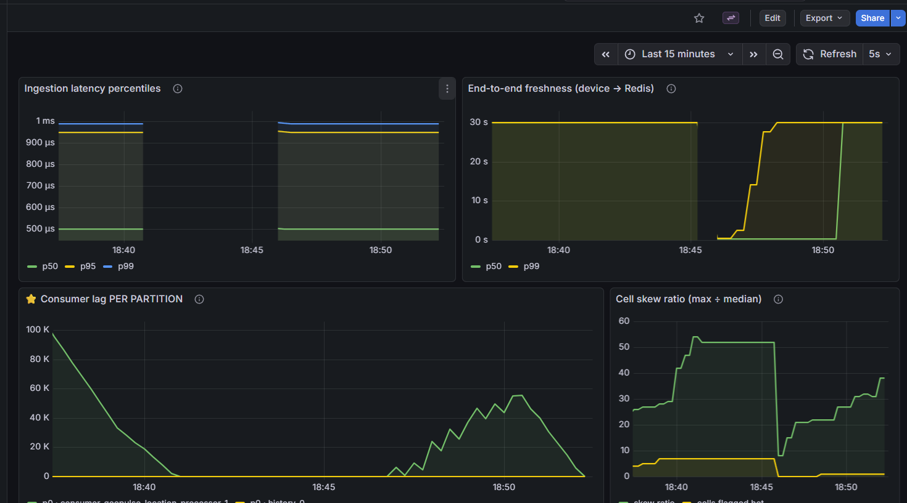

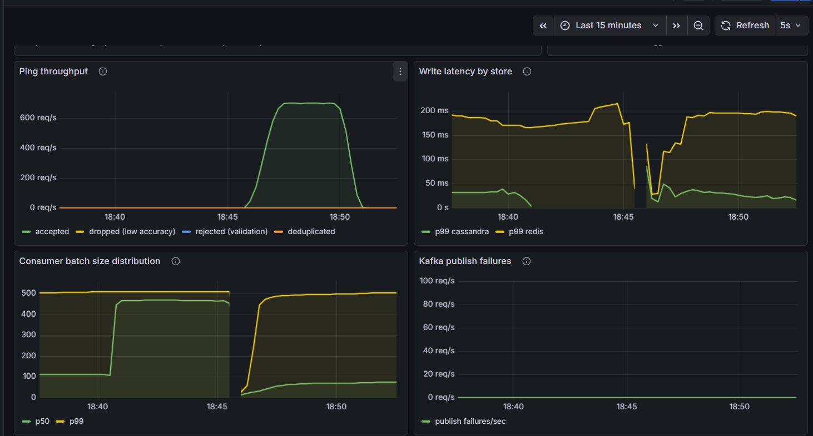

**Lag climbed to 55k.** So 700/s is also past the ceiling, just less so.

| Rate | Peak lag | Verdict |
|---|---|---|
| 500/s | 12.5k, **drained during the run** | ✅ Sustainable |
| 700/s | 55k, climbing | ❌ Past |
| 1,000/s | 125k, climbing | ❌ Well past |

**Ceiling located: ~500 req/sec.**

> **Ingestion p99 is a perfectly straight line at ~1 ms for the whole run.** About as clean a demonstration as exists that the write edge is decoupled from downstream pressure.

---

## Run 7 — Second consumer instance

**Hypothesis:** 4 threads do ~500/s, so 8 threads should do ~1,000/s. If lag stays bounded where it previously hit 125k, horizontal scaling is *measured* rather than asserted.

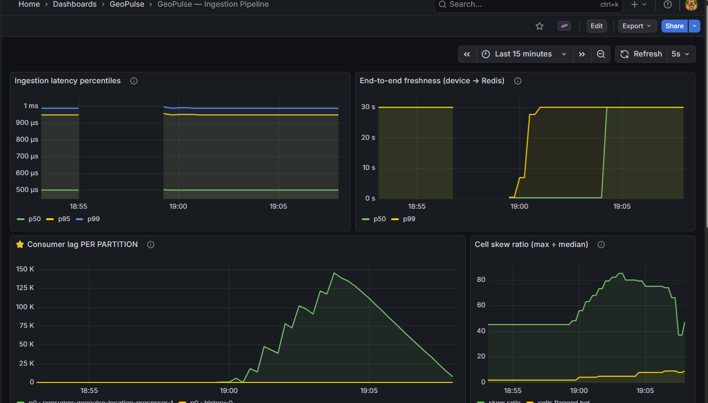

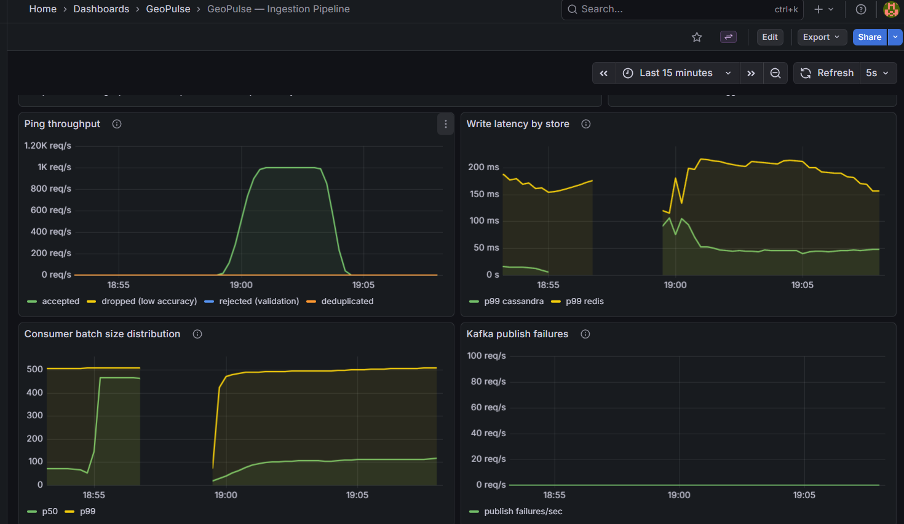

**Result: lag hit 140k — no improvement over the single-instance run.**

The second instance *did* join correctly:

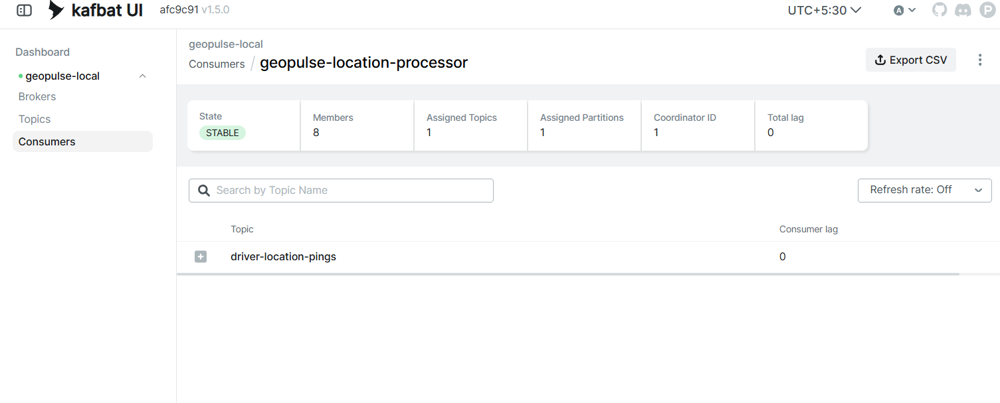

### 🔍 The evidence that explains it

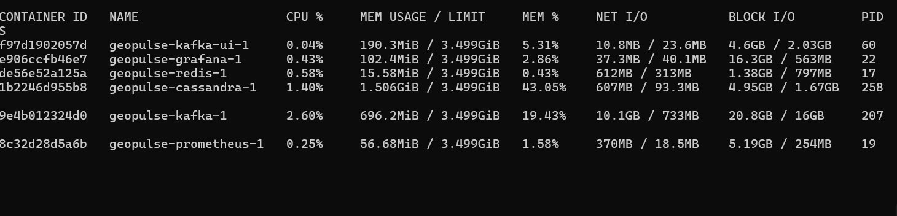

```
redis      0.58% CPU     ← not saturated
cassandra  1.40% CPU
kafka      2.60% CPU     ← nothing in Docker is working hard
```

> **This kills the "Redis is the bottleneck" theory.** Every container is nearly idle. The constraint is **host CPU and memory**, shared between k6 and now **four JVMs** on a machine already at 96–97% memory.

> **Adding a second instance made the real problem worse** — another JVM on a memory-starved host means both instances got *less* CPU each. **You split the same constrained resource two ways.**

> **Therefore horizontal scaling is UNTESTED, not disproven.** You cannot measure whether adding consumers helps when adding a consumer takes resources away from the consumers you already have. **The generator and the system under test must be isolated for that question to be answerable at all.**

---

## What this means for the design

### Partition sizing — the estimate was invalidated

```
Session 1.3 ESTIMATE:   5,000 records/sec/consumer  →    64 partitions
MEASURED:                 ~125 records/sec/thread   →  ~2,000 partitions
```

⚠️ **2,000 is not the answer** — that figure is dominated by the environment. **The honest statement is that the estimate was invalidated, not that 2,000 is correct.** Partition count is a one-way door: you can raise it but never lower it, and raising it rehashes the key space. Discovering this in production would mean that rehash at the worst possible moment. **That is precisely why this phase existed.**

### Would it do 250k/sec in production?

| ✅ Validated | ⚠️ Untested |
|---|---|
| Ingestion cost independent of downstream pressure | **Redis Cluster** — one instance benchmarks at ~42k ops/sec; 250k writes/sec needs **~1M Redis ops/sec**. Cell keys shard naturally by design, but this has **never been tested** |
| No shared lock or global coordination in the path | **Cassandra at RF=3** — ~4.3 TB/day across two tables; schema validated against **one node** |
| Scales by adding partitions and consumers, not bigger machines | **Salt width at scale** — 4 sub-partitions may be nowhere near enough for an airport cell at 250k/s |
| | **Rebalances at 25–50 instances** become a serious operational event in themselves |

> **The biggest untested assumption is Redis Cluster** — the component with the hardest per-instance ceiling and the one the design leans on most.

---

## The defensible claim

> *"On a single development machine with the load generator co-located, the pipeline sustained ~500 writes/sec with bounded consumer lag and ingestion p99 under 1 ms — demonstrating that the async write edge is decoupled from downstream pressure even while the pipeline was 140,000 messages behind.*
>
> *Load testing found two real bottlenecks: an unsized Redis connection pool and an un-pipelined per-record dedup call, together responsible for a ~60× reduction in write latency (1,800 ms → 30 ms p99).*
>
> *Measured per-consumer throughput was far below the 5,000/sec design estimate, invalidating the original 64-partition sizing.*
>
> *Horizontal scaling could not be validated: `docker stats` showed every container under 3% CPU, so the ceiling is host CPU and memory shared between the generator and four JVMs — adding a second consumer instance reduced per-instance resources rather than adding capacity. Validating that claim requires an environment where the generator is isolated from the system under test."*

**What makes this strong isn't the claim — it's the boundary.** *"It scales to 250k"* backed by a laptop test collapses under five minutes of questioning. *"Here's what I proved, here's what I extrapolated, here's what remains untested"* is a claim nobody can dismantle, **because the dismantling is already done.**

---

## Lessons

1. **A timer measures everything inside it** — including queuing for the resource. "Slow database" and "no connection available" are indistinguishable from outside and have opposite fixes.
2. **CPU tells you what latency can't.** A saturated component is *busy*; an idle one reporting high latency is *waiting for someone else*.
3. **Small batches mean you're winning**; batches pinned at `max-poll-records` mean saturation.
4. **Adding capacity to a resource-starved host removes capacity.**
5. **Untestable ≠ disproven.** Naming what you couldn't measure is stronger than asserting what you didn't.
6. **Untested estimates become permanent** — ours was about to be baked into a decision that can't be reversed.
7. **A load test that doesn't reproduce your traffic's shape measures a system you don't have.** Uniform random coordinates would have produced even partition load and hidden the hot-cell behaviour entirely.
8. **Closed-loop testing throttles itself** to whatever you can serve — open-loop arrival rates are the only way to find a ceiling.
9. **Warm-up is not optional.** A cold JVM's p99 is JIT compilation, not your code.

---

## Reproducing

```bash
docker compose down -v && docker compose up -d
docker compose exec -T cassandra cqlsh < cassandra/schema.cql
# create topics, start the three services, then:
k6 run --summary-export=loadtest/results/summary.json loadtest/ingest-load.js
```

**k6 thresholds double as SLO assertions** and exit non-zero on failure, so this runs in CI as a regression gate — *"we load-tested it once"* becomes *"we can't regress past our SLO without noticing."*

Between runs, `docker compose exec redis redis-cli FLUSHDB` clears accumulated dedup keys so comparisons stay clean.
